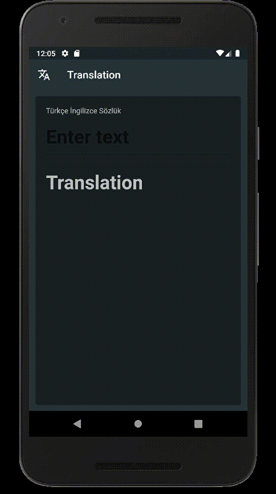
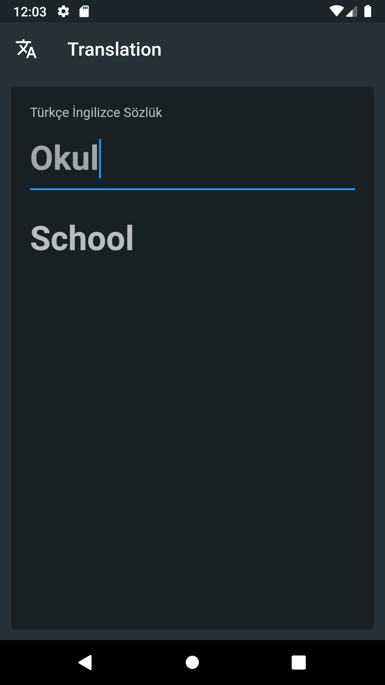

### Used Packages:

translator: https://pub.dev/packages/translator/install
http: flutter pub add http

### Used API:

Cloud Translation API: https://console.cloud.google.com/apis/library/translate.googleapis.com?project=thermal-apricot-357510

